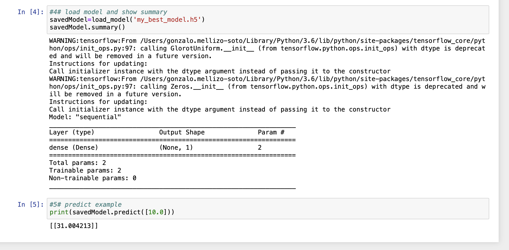
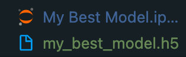
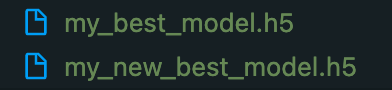
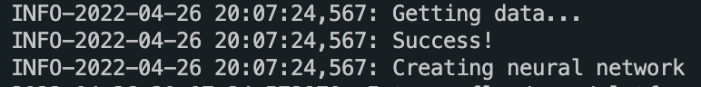

# MLOps Engineer Interview Project

### **High level spec**

Data Scientist team created a Jupyter notebook `My Best Model.ipynb` that contains all the code to train, save, load and inference.
Your task is to create a REST API in python that serves the model and allows for online inference.
You should create 1 endpoint that accepts relevant input and returns the infernece results to the client.

-----

### **How to share your results?**
- [X] Clone this repository and create your own branch to work on.
- [ ] .... develop .....
- [ ] Once you are ready, create a pull request with your code.


### **Evaluation:**
- [ ] There should be **at least** one test written and the README file should include instructions on how to execute it.
- [ ] You should provide clear documentation of the API, you can use Swagger or any other format.
- [ ] README file should include clear instructions on how to deploy / start the application.
- [ ] No crashes or bugs.
- [ ] Code is easily understood and communicative (eg. comments, variable names, etc). 
- [ ] Everything that you decide to not do due to the limitation of time should be documented in the README.
- [ ] GitHub commit history is consistent, easy to follow and understand. 

-----

## Project Response

### Create a development environment

The first step is t have a look at the code a differentiate teh different parts involved in the whole process.

As we can see the noteboook code is easily readeable and well documented with comments but misses a very important thing, the dependencies requirements. In order to make this fully reproducible whe need to asses this a pin the dependencies down.

For this we are going to create a virtual environment and add a `.gitignore` so we don't add files that are not really needed (like de new environment). For our purpuose [this one](https://github.com/github/gitignore/blob/main/Python.gitignore) will be enough.

Now with the environment. To create we will use `python 3.8` using `pyenv`, to install `pyenv` follow the instrunctions at it's [github page](https://github.com/pyenv/pyenv).

Download `python 3.8`:

```bash
pyenv install 3.8.12 # If using and older version of pyenv It might ask you tu upgrade with a simple command
```

Activate pyenv shell, this will make the new installed version usable in the shell:

```bash
pyenv shell 3.8.12

# Make sure that it is activated
python --version
# Python 3.8.12
```

Create virtual environment:

```bash
# Install viertualenv
pip install virtualenv

# Create new environment
virtualenv .venv

# Activate new environment
source .venv/bin/activate
```

Now we have a new isolated environment to develop. Time to get the requirements.

### Getting the requirements

We can see the main dependencies used in the first cell of the notebook:

```python
#1# Import dependencies
import tensorflow as tf
from tensorflow.keras.models import load_model
import numpy as np
from tensorflow import keras
```

Mainly `tensorflow` and `numpy` (this one is a sub dependency of tensorflow). We could ask the author of the notebook the versions that were used in the development but lets assume that the latest versions were used, so lets install them.

```bash
pip install tensorflow
```

Now lets make this a little more reproducible by getting the exact versions and creating a `requirements_model.txt`:

```bash
pip freeze | grep -E 'tensorflow=|keras|numpy' > requirements_model.txt

# requirements_model.txt
keras==2.8.0
numpy==1.22.3
tensorflow==2.8.0
```

Now anyone will have the exact same dependencies by executing:

```bash
pip install -r requirements_model.txt
```

### Executing the code

We have our environment, our dependencies, so now lets execute the code. For this we could follow different steps:

* Install `jupyter` launch the command `jupyter-notebook` open the ntebook and execute it.
* Export the code to a `.py` file. We could do this using `nbconvert` or by hand and the executed with the python interpreter.

#### Using Jupyter

Install jupyter:

```bash
pip install jupyter
```

With the environment activated (important) start the server and open it:

```bash
jupyter-notebook

# URL example
http://localhost:8888/?token=b21828e2084f0d27640df54aa7979a5ba2fc6de6f90bab7f
```

Open the notebook and execute cell by cell (shift + enter).



The prediction is made and the model is saved.




#### Exporting it to py files

We could use `nbconvert` but due to the low complexity we are going to doing by hand and we are going to divide this into to scripts `train.py` and `predict.py` that will help us in the future when testing. We'll create a python module (and create an `__init__.py` file) so we can import it later in the tests.

```
.
├── LICENSE
├── My\ Best\ Model.ipynb
├── README.md
├── img
├── requirements_model.txt
└── src
    ├── __init__.py
    ├── predict.py
    └── train.py
```

For the training part we'll get the first three cells and for the prediction script we will use `from tensorflow.keras.models import load_model` as the other dependencies aare note needed for loading the model and giving predictions.

Now we have the code but getting them into two files does not easy its execution, now we need two calls for the whole process:

```bash
# Execute training and save
python src/train.py

# Execute load and inference
python src/predict
```

This in itself is not bad but we can improve it.

### Improving the code

Now the code is modular but we could improve it by using functions that make reusable pieces of code.

For `train.py` we can observe that two main functionalities training and saving so lets create two reusable functions:

```python
def train_model(optimizer='sgd', loss='mean_squared_error'):
    # Define and compile the neural network
    model = tf.keras.Sequential([keras.layers.Dense(units=1, input_shape=[1])])
    model.compile(optimizer=optimizer, loss=loss)
    # Provide the data
    xs = np.array([-1.0, 0.0, 1.0, 2.0, 3.0, 4.0], dtype=float)
    ys = np.array([-2.0, 1.0, 4.0, 7.0, 10.0, 13.0], dtype=float)

    # Train the neural network
    model.fit(xs, ys, epochs=500)

def save_model(model, name):
    # Save model into file
    model.save(f'{name}.h5')
    print('Model Saved!')

if __name__ == "__main__":
    model = train_model()
    save_model(model, "my_new_best_model")
```

Now we can execute it and create models with new names.



Now the data is created inside the training function so lets add a new functin that creates data and the training function gets two new arguments to provide taht data:

```python
def get_data():

    # Provide the data
    xs = np.array([-1.0, 0.0, 1.0, 2.0, 3.0, 4.0], dtype=float)
    ys = np.array([-2.0, 1.0, 4.0, 7.0, 10.0, 13.0], dtype=float)

    return xs, ys


def train_model(X, y, optimizer='sgd', loss='mean_squared_error'):
    ...

if __name__ == "__main__":
    X, y = get_data()
    model = train_model(X, y)
    save_model(model, "my_new_best_model")
```

Now we can modify the `get_data` in the case we needed to get the data from another source (locally, s3, database...) and feed it into the model.

Lets use a bit of logging and add some new logs.



As with the `train.py` script we can see two main functionalities in the `predict.py` script so lets create two functions and add logging as well.

```python
import logging

from tensorflow.keras.models import load_model

logger = logging.getLogger("prediction")
FORMAT = '%(levelname)s-%(asctime)s: %(message)s'
logging.basicConfig(format=FORMAT, level=logging.INFO)

def load_keras_model(path):

    # Load model and show summary
    logger.info(f"Loading model from: {path}")
    savedModel=load_model(path)
    savedModel.summary()

    return savedModel

def predict(data, model):
    # Predict example
    prediction = model.predict(data)
    logging.info(f"Input: {data} Prediction: {prediction}")

    return prediction

if __name__ == "__main__":
    model = load_keras_model("my_new_best_model.h5")
    predict([10], model)

# Log
INFO-2022-04-26 20:17:00,644: Input: [10] Prediction: [[30.99669]]
```