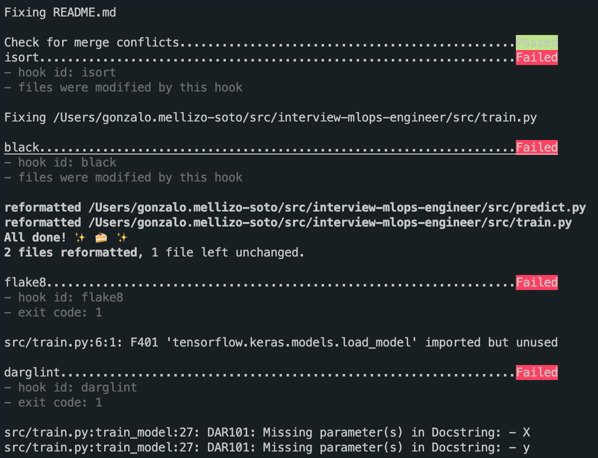
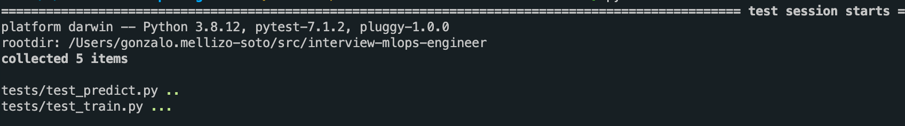
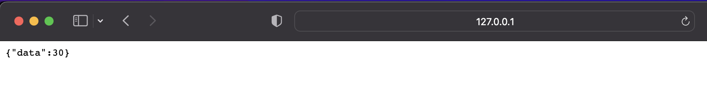

# MLOps Engineer Interview Project

### **High level spec**

Data Scientist team created a Jupyter notebook `My Best Model.ipynb` that contains all the code to train, save, load and inference.
Your task is to create a REST API in python that serves the model and allows for online inference.
You should create 1 endpoint that accepts relevant input and returns the infernece results to the client.

-----

### **How to share your results?**
- [X] Clone this repository and create your own branch to work on.
- [X] .... develop .....
- [ ] Once you are ready, create a pull request with your code.


### **Evaluation:**
- [ ] There should be **at least** one test written and the README file should include instructions on how to execute it.
- [ ] You should provide clear documentation of the API, you can use Swagger or any other format.
- [ ] README file should include clear instructions on how to deploy / start the application.
- [ ] No crashes or bugs.
- [ ] Code is easily understood and communicative (eg. comments, variable names, etc).
- [ ] Everything that you decide to not do due to the limitation of time should be documented in the README.
- [ ] GitHub commit history is consistent, easy to follow and understand.

-----

## Project Response

### Create a development environment

The first step is t have a look at the code a differentiate teh different parts involved in the whole process.

As we can see the noteboook code is easily readeable and well documented with comments but misses a very important thing, the dependencies requirements. In order to make this fully reproducible whe need to asses this a pin the dependencies down.

For this we are going to create a virtual environment and add a `.gitignore` so we don't add files that are not really needed (like de new environment). For our purpuose [this one](https://github.com/github/gitignore/blob/main/Python.gitignore) will be enough.

Now with the environment. To create we will use `python 3.8` using `pyenv`, to install `pyenv` follow the instrunctions at it's [github page](https://github.com/pyenv/pyenv).

Download `python 3.8`:

```bash
pyenv install 3.8.12 # If using and older version of pyenv It might ask you tu upgrade with a simple command
```

Activate pyenv shell, this will make the new installed version usable in the shell:

```bash
pyenv shell 3.8.12

# Make sure that it is activated
python --version
# Python 3.8.12
```

Create virtual environment:

```bash
# Install viertualenv
pip install virtualenv

# Create new environment
virtualenv .venv

# Activate new environment
source .venv/bin/activate
```

Now we have a new isolated environment to develop. Time to get the requirements.

### Getting the requirements

We can see the main dependencies used in the first cell of the notebook:

```python
#1# Import dependencies
import tensorflow as tf
from tensorflow.keras.models import load_model
import numpy as np
from tensorflow import keras
```

Mainly `tensorflow` and `numpy` (this one is a sub dependency of tensorflow). We could ask the author of the notebook the versions that were used in the development but lets assume that the latest versions were used, so lets install them.

```bash
pip install tensorflow
```

Now lets make this a little more reproducible by getting the exact versions and creating a `requirements_model.txt`:

```bash
pip freeze | grep -E 'tensorflow=|keras|numpy' > requirements_model.txt

# requirements_model.txt
keras==2.8.0
numpy==1.22.3
tensorflow==2.8.0
```

Now anyone will have the exact same dependencies by executing:

```bash
pip install -r requirements_model.txt
```

### Executing the code

We have our environment, our dependencies, so now lets execute the code. For this we could follow different steps:

* Install `jupyter` launch the command `jupyter-notebook` open the ntebook and execute it.
* Export the code to a `.py` file. We could do this using `nbconvert` or by hand and the executed with the python interpreter.

#### Using Jupyter

Install jupyter:

```bash
pip install jupyter
```

With the environment activated (important) start the server and open it:

```bash
jupyter-notebook

# URL example
http://localhost:8888/?token=b21828e2084f0d27640df54aa7979a5ba2fc6de6f90bab7f
```

Open the notebook and execute cell by cell (shift + enter).


The prediction is made and the model is saved.


#### Exporting it to py files

We could use `nbconvert` but due to the low complexity we are going to doing by hand and we are going to divide this into to scripts `train.py` and `predict.py` that will help us in the future when testing. We'll create a python module (and create an `__init__.py` file) so we can import it later in the tests.

```
.
├── LICENSE
├── My\ Best\ Model.ipynb
├── README.md
├── img
├── requirements_model.txt
└── src
    ├── __init__.py
    ├── predict.py
    └── train.py
```

For the training part we'll get the first three cells and for the prediction script we will use `from tensorflow.keras.models import load_model` as the other dependencies aare note needed for loading the model and giving predictions.

Now we have the code but getting them into two files does not easy its execution, now we need two calls for the whole process:

```bash
# Execute training and save
python src/train.py

# Execute load and inference
python src/predict
```

This in itself is not bad but we can improve it.

### Improving the code

Now the code is modular but we could improve it by using functions that make reusable pieces of code.

For `train.py` we can observe that two main functionalities training and saving so lets create two reusable functions:

```python
def train_model(optimizer='sgd', loss='mean_squared_error'):
    # Define and compile the neural network
    model = tf.keras.Sequential([keras.layers.Dense(units=1, input_shape=[1])])
    model.compile(optimizer=optimizer, loss=loss)
    # Provide the data
    xs = np.array([-1.0, 0.0, 1.0, 2.0, 3.0, 4.0], dtype=float)
    ys = np.array([-2.0, 1.0, 4.0, 7.0, 10.0, 13.0], dtype=float)

    # Train the neural network
    model.fit(xs, ys, epochs=500)

def save_model(model, name):
    # Save model into file
    model.save(f'{name}.h5')
    print('Model Saved!')

if __name__ == "__main__":
    model = train_model()
    save_model(model, "my_new_best_model")
```

Now we can execute it and create models with new names.


Now the data is created inside the training function so lets add a new functin that creates data and the training function gets two new arguments to provide taht data:

```python
def get_data():

    # Provide the data
    xs = np.array([-1.0, 0.0, 1.0, 2.0, 3.0, 4.0], dtype=float)
    ys = np.array([-2.0, 1.0, 4.0, 7.0, 10.0, 13.0], dtype=float)

    return xs, ys


def train_model(X, y, optimizer='sgd', loss='mean_squared_error'):
    ...

if __name__ == "__main__":
    X, y = get_data()
    model = train_model(X, y)
    save_model(model, "my_new_best_model")
```

Now we can modify the `get_data` in the case we needed to get the data from another source (locally, s3, database...) and feed it into the model.

Lets use a bit of logging and add some new logs.


As with the `train.py` script we can see two main functionalities in the `predict.py` script so lets create two functions and add logging as well.

```python
import logging

from tensorflow.keras.models import load_model

logger = logging.getLogger("prediction")
FORMAT = '%(levelname)s-%(asctime)s: %(message)s'
logging.basicConfig(format=FORMAT, level=logging.INFO)

def load_keras_model(path):

    # Load model and show summary
    logger.info(f"Loading model from: {path}")
    savedModel=load_model(path)
    savedModel.summary()

    return savedModel

def predict(data, model):
    # Predict example
    prediction = model.predict(data)
    logging.info(f"Input: {data} Prediction: {prediction}")

    return prediction

if __name__ == "__main__":
    model = load_keras_model("my_new_best_model.h5")
    predict([10], model)

# Log
INFO-2022-04-26 20:17:00,644: Input: [10] Prediction: [[30.99669]]
```

### Improving Quality

We have more modular code but we can improve the quality of it by adding code and docstring linting and formatting. We could do it manually but [pre-commit](https://pre-commit.com/) can handle it automatically for us with a simple configuration.

Lets create a development requirements file, `requirements_dev.txt` and add `pre-commit` to it and install it.

```bash
pip install -r requirements_dev.txt
```

And create a configuration file `.pre-commit-config.yaml`:

```yaml
repos:
-   repo: https://github.com/pre-commit/pre-commit-hooks
    rev: v2.3.0
    hooks:
    -   id: requirements-txt-fixer
    -   id: end-of-file-fixer
    -   id: trailing-whitespace
    -   id: check-merge-conflict
-   repo: https://github.com/PyCQA/isort
    rev: 5.6.4
    hooks:
    -   id: isort
        args:
          - --multi-line=3
          - --trailing-comma
          - --force-grid-wrap=0
          - --use-parentheses
          - --line-width=88
-   repo: https://github.com/psf/black
    rev: 20.8b0
    hooks:
    -   id: black
-   repo: https://gitlab.com/PyCQA/flake8
    rev: 3.8.3
    hooks:
    -   id: flake8
-   repo: https://github.com/terrencepreilly/darglint
    rev: v1.8.1
    hooks:
    -   id: darglint
        args:
          - -v 2
```

This are the hooks we are going to use in every commit, `flake8` and `darglint` for linting, `black` and `isort` for formatting. The lets install the hooks:

```bash
pre-commit install
```

And lets run all the files:

```bash
pre-commit run --all-files
```

This will execute all the linting and formatting in all the files. From now on, every file modified will automatically pass this quality when trying to commit it.



Now lets fix all the errors and add all the hooks to the `requirements_dev.txt` so we can used the tools indepently of having to commit a file. Also as we need this to develop we can add `requirements_model.txt` as a dependency soo by installing `requirements_dev.txt` we also install the dependencies needed for the project.

```
-r requirements_model.txt
pre-commit==2.18.1
isort==5.6.4
black==20.8b0
flake8==3.8.3
darglint==1.8.1

# Now executing this will install both requirements:
pip install -r requirements_dev.txt
```

We have better quality but code changes might break the training and prediction scripts so to make sure lets add tests for the training and prediction.

### Adding tests

To make sure that further changes to the code don't break it we are going to add tests for both scripts. For this we install `pytest`, add it to `requirements_dev.txt`, create an empty `conftest.py` and a `tests` folder.

Then we will create two scripts one for `train.py` as `test_train.py` and one for `predict.py` as `test_predict.py`.

An example for the `get_data` function at `train.py`:

```python
import numpy as np

from src import train

def test_get_data():

    """
    This should test the `get_data` function returns an a tuple with numpy arrays
    """

    result = train.get_data()
    X, y = result

    assert isinstance(result, tuple)
    assert isinstance(X, np.ndarray)
    assert isinstance(y, np.ndarray)

```

Because we made a module the scripts are easy to import and test that they are working properly. Now we add the test for the remaining functions. Some functions perform a simple action likea loading a model so the tests we are going to add are simple but for more complex code this would test that any of the logic inside the function continues to work.

Now that the are some tests we can execute them with the command `pytest`:



Now we have improved our code a bit so lets start with the Rest API to perform predictions.

### Creating the Rest API

For this we have to select a framework in this case [FastAPI](https://fastapi.tiangolo.com/) is my choice to develop the Rest API as I fell more confortable with it but que could have choosen `Flask` or `Django-REST`. FastAPi have some advantages like data validation out of the box, OpenAPI support or good performance.

To keep everything in order lets create an `app.py` file where all the logic of the API is going to be developed.


When creating the API we have to consider a couple of things:

* When will be the model loaded?
* Shape of the input data
* What do we need to log?

For the first question we should not load the model for each prediction as it will result in slow predictions so we should load when the applciation starts and keep it cached. With FastAPI whe can perform the loading of the model before the application fully loads so this will be handy in dealing  with the model caching and improve the performance as the model is already in memory for each prediction.

FastAPI is based on [Pydantic](https://pydantic-docs.helpmanual.io/) this allows for good performance in serialization and deserialization, also it performs the data validation for us so if a prediction does not have the desired schema a 422 HTTP Error will be thrown.

It is of interest to log the input data and the output predictions, this will allow as to measure our model performance in the long run. This oculd be directly logged into the stdout or a file for our purpuose it will be logged into stdout.

As we selected FastAPI we need to install it and add it into our `requirements_model.txt`.

Lets create a simple app:

```python
from fastapi import FastAPI

app = FastAPI()

@app.get("/predict", status_code=200)
def predict():
    return {"data": 30}
```

We have a single `predict` endpoint thath when requested always returns a dummy prediction. Lets run it, we could use the basic FastAPI application startup but lets improve it by using `uvicorn` as it is production ready.

```bash
# Install uvicorn and add it to the requirements
pip install uvicorn==0.17.6

# Run the application
uvicorn --reload src.app:app
```

We can see that the application has started and if we go to the web browser to `http://127.0.0.1:8000/predict` we can see the result:



Also we can go to `http://127.0.0.1:8000/docs` where an automatic OpenAPI is shown and we can test our endpoint from there:


We have our endpoint working, lets try to load a model before the application starts and make a prediction:

```python
from typing import List
from fastapi import FastAPI
from pydantic import BaseModel

from src.predict import load_keras_model, predict

class InputData(BaseModel):
    data: List[int]

class ResponseData(BaseModel):
    prediction: float

model = load_keras_model("my_best_model.h5")

app = FastAPI()

@app.post("/predict", status_code=200, response_model=ResponseData)
def predict_model(data: InputData):

    return ResponseData(prediction=predict(data.data, model).item(0))
```

Lets unpack what happening here:

* We created `InputData` this class uses `pydantic` to create the schema using python typing, this will be how we spect the data to come, we will have a field `data` with a list of integers in it. If the request does not follows this schemas a validation error will be raised. This will be an  argument in our endpoint function that its expected to cme in the body of the request.

```json
{
    "data": [10]
}
```

* A `ResponseData` that acts as our response schema that will return a response as the following:

```json
{
    "prediction": 30.012
}
```

* Now its when creating the `predict.py` comes in handy as we can reuse the code to load the model. This instance is shared across the application and fully cached in memory to reduce prediction times.

* And finally we change the endpoint to a POST so it can accept a body and make the prediction using the previous developed function at `predict.py`.

Now lets clean a bit the code and add a bit of documentation, add some tests and create a configuration file for the app.
